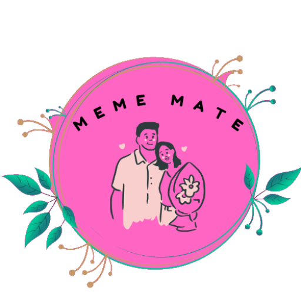
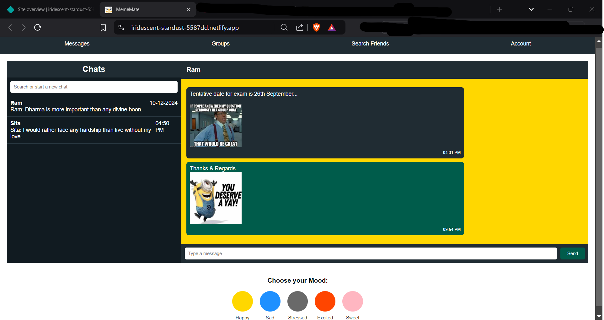
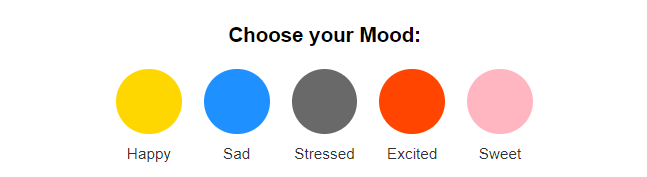
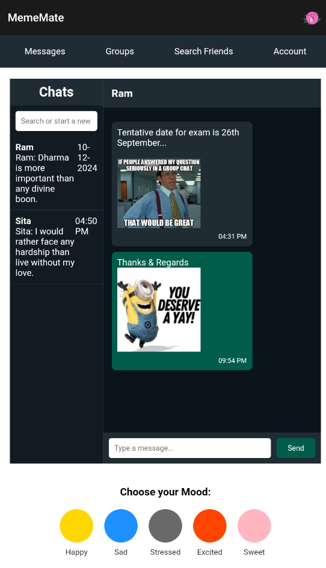

# **MemeMate**
MemeMate is a unique meme-driven dating app where humor meets connection. It enables users to express their mood, create and share memes, and build relationships in a fun and interactive way. It is an innovative dating app that combines humor, creativity, and mood-based personalization to help people connect in a fun and interactive way. It's not just about dating; it's about building meaningful connections through memes and shared experiences.

---

## **Table of Contents**
1. [Overview](#overview)
2. [Features](#features)
3. [Mood-Based Themes](#mood-based-themes)
4. [Live Demo](#live-demo)
5. [Tech Stack](#tech-stack)
6. [How to Run Locally](#how-to-run-locally)
7. [Screenshots](#screenshots)
8. [Contributing](#contributing)
9. [License](#license)

---

## **Overview**
**MemeMate** redefines the online dating experience by blending creativity and emotions. Users can express themselves through mood-based themes, generate and share memes, and engage in meaningful conversations.

---

## **Features**

1. **Mood-Based Personalization**
   - Choose a color theme that reflects your current mood.

2. **AI-Powered Meme Generation**
   - Create custom memes using built-in AI tools.

3. **Interactive Chat System**
   - Chat with friends or potential matches using memes as icebreakers.

4. **Group Chats and Communities**
   - Build or join groups to expand your network and meet like-minded people.

5. **Seamless User Experience**
   - Enjoy a sleek and responsive design for web and mobile platforms.

---

## **Mood-Based Themes**
MemeMate allows users to change their app theme based on their mood. Below are the available themes:

| **Mood**       | **Color**    | **Hex Code**  |
|-----------------|-------------|---------------|
| 🟡 **Happy**   | Gold         | `#FFD700`     |
| 🔵 **Sad**     | Dodger Blue  | `#1E90FF`     |
| ⚫ **Stressed** | Gray         | `#696969`     |
| 🟠 **Excited** | Orange Red   | `#FF4500`     |
| 🎀 **Sweet**   | Light Pink   | `#FFB6C1`     |

---

## **Live Demo**
Check out the live demo of **MemeMate**:  
[🔗 MemeMate Website](https://iridescent-stardust-5587dd.netlify.app/)

---

## **Tech Stack**
- **Frontend**: HTML, CSS, JavaScript
- **Deployment**: Netlify

---

## **How to Run Locally**

To set up MemeMate on your local machine:

1. Clone the repository:
   ```bash
   git clone https://github.com/yourusername/mememate.git
   cd mememate
   ```

2. Open the `index.html` file in a browser.

3. (Optional) Use a local server:
   ```bash
   python -m http.server 8000
   ```
   Access the app at `http://localhost:8000`.

---

## **Screenshots**
### **Logo**


### **Web Page**


### **Mood-Based Themes**


### **Mobile Interface**



---

## **Contributing**
We welcome contributions! Here's how you can help:

1. Fork the repository.
2. Create a new branch:
   ```bash
   git checkout -b feature-name
   ```
3. Commit your changes:
   ```bash
   git commit -m "Add feature description"
   ```
4. Push your changes:
   ```bash
   git push origin feature-name
   ```
5. Submit a pull request.

---

## **License**
This project is licensed under the **MIT License**. See the [LICENSE](LICENSE) file for details.

---

## **Contact**
For feedback, queries, or suggestions, feel free to reach out:

- 👤 **GitHub**: [Rik-21](https://github.com/Rik-21)
